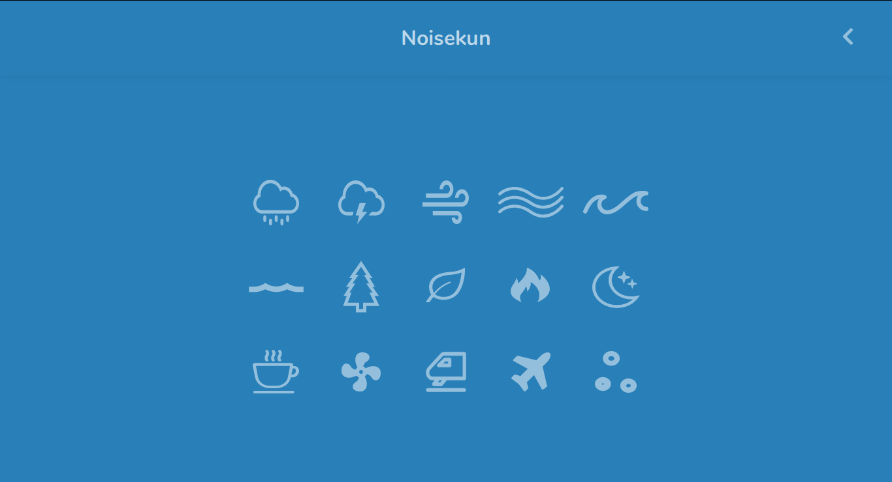
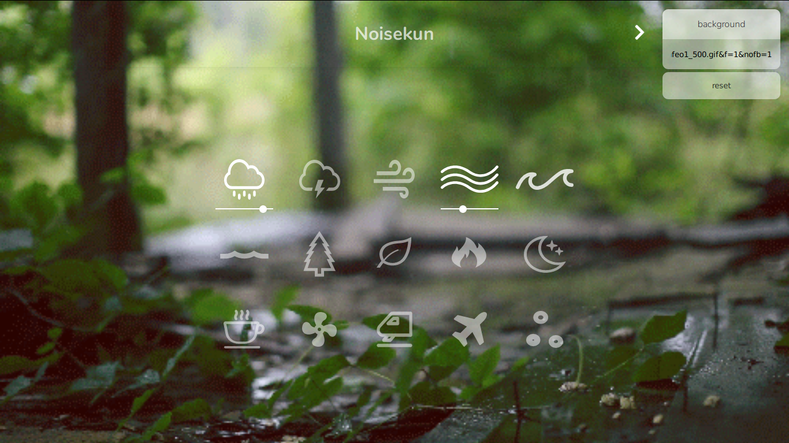
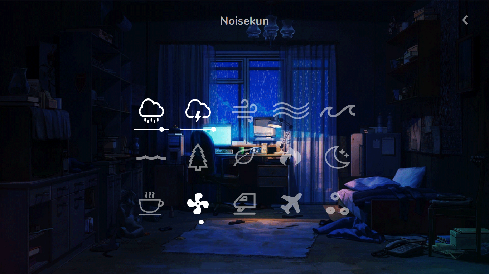

<div align="center">

# 

### _Listen combinations of ambient sounds for **relaxing** or getting more **productive** on your task!_

  [](https://www.codefactor.io/repository/github/mateusfg7/noisekun) 


</div>

---

[Front-end](https://github.com/mateusfg7/Noisekun) made with ReactJS and Typescript.

[Back-end](https://github.com/mateusfg7/Noisekun-backend) made with Deno and Typescript.

To add your own back-end, change the host in `defaultVariables.ts`, on line 4:

```javascript
const HOST = 'https://noisekun-server.herokuapp.com';
```

_e.g:_

```javascript
const HOST = 'http://0.0.0.0:8000';
```

> default back-end host: https://noisekun-server.herokuapp.com

---

## Screenshots

| [](https://mateusfg7.github.io/Noisekun/) | [](https://mateusfg7.github.io/Noisekun/) |
| ------------------------------------------------------------------------------ | ------------------------------------------------------------------------------ |
| [](https://mateusfg7.github.io/Noisekun/) | [](https://mateusfg7.github.io/Noisekun/) |

---

<table align="center">
    <tr align="center">
        <td>
            <h3>Doe :heart:</h3>
        </td>
    </tr>
    <tr>
        <td>
            <b title="BTC">Bitcoin</b>: <em title="BTC">bc1qzdr4z8sxhumv68s2l97rj0pjum2tnr745uh8us</em>
            <br/>
            <b title="BCH">Bitcoin Cash</b>: <em title="BCH">qr4glglnc66desgumtjattkxmps999twg50wyd7ymy</em>
            <br/>
            <b title="ETH">Ethereum</b>: <em title="ETH">0x4a576AC4b87e3F22700dd3462e02d863Ce2B8817</em>
            <br/>
            <b title="LTC">Litecoin</b>: <em title="LTC">ltc1qnrdjc633fx03r98gazjqjeqdz0svs45l9mypfr</em>
            <br/>
            <b title="DASH">Dash</b>: <em title="DASH">Xp9JFeALHdLr9FNbkE6Na3xMqRRTs75YWx</em>
        </td>
    </tr>
</table>

> _Inspired by [Noisli](https://www.noisli.com/)_
